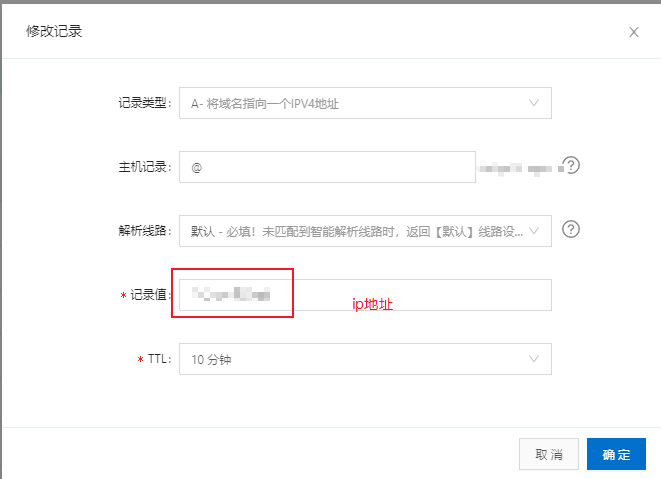
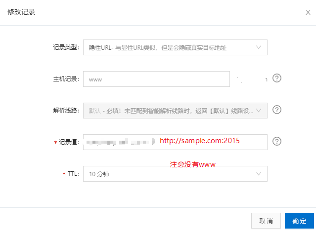

title: 阿里云部署非80端口
id: 1587520614767
author: bofan
tags:
  - 运行环境
categories: []
date: 2020-04-22 09:56:00
---
## 1. 前言
 
  阿里云默认只识别一个80端口，如果在服务器上部署多个web服务/网站，那只能访问一个80端口的网站。这篇文章讲述如何使用非80端口，类似80端口的访问方法


## 2.说明 
> 这里以 *caddy* web 服务为列，启动2015端口
### 2.1 配置
- [x] 添加一条A记录指向ip地址


- [x] 添加一条www记录指向域名地址:端口



## 3.完成 
 
 此时访问网址：``` www.sample.com ``` 即可